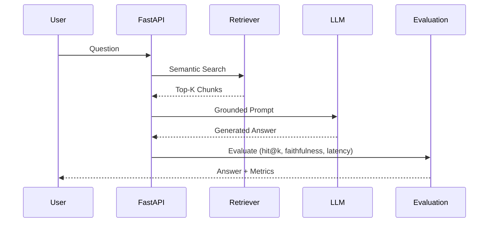

# RAG Knowledge Assistant
### Production-Grade Retrieval-Augmented Generation (RAG) System

---

## 📌 Overview

This project implements a **production-grade Retrieval-Augmented Generation (RAG) system** that retrieves relevant documents using vector search and generates **grounded, context-aware responses** using a Large Language Model.

Unlike basic LLM demos, this system explicitly includes:
- Retrieval accuracy evaluation
- Hallucination (faithfulness) checks
- Latency measurement
- Experiment-driven tuning
- Deployment-ready API

---

## 🎯 Problem Statement

Large Language Models (LLMs) often generate confident but incorrect answers when operating without reliable context.  
This project addresses that issue by:

- Retrieving **semantically relevant document chunks**
- Enforcing **strict prompt grounding**
- Measuring **retrieval quality (hit@k)**
- Verifying **answer faithfulness**
- Tracking **system latency** for production readiness  

---

## 🧠 High-Level Architecture


---

## 🗂️ Project Structure

```
rag-knowledge-assistant/
│
├── app/
│   ├── ingestion/
│   ├── rag/
│   ├── evaluation/
│   ├── config.py
│   └── main.py
│
├── data/
├── experiments/
├── Dockerfile
└── README.md
```

---

## 🔄 End-to-End Workflow



---

## 🧪 Evaluation Methodology

### Retrieval Accuracy — hit@k
Measures whether retrieved chunks contain expected query terms.

### Answer Faithfulness
Ensures generated responses are fully grounded in retrieved context.

### System Metrics
- End-to-end latency
- Retrieval confidence
- Hallucination prevention

---

## 📊 Experiment Results

### Retrieval Depth (k)

| k | hit@k | Faithful | Latency |
|---|------|----------|---------|
| 3 | 0.68 | 82% | 0.94s |
| 5 | 0.82 | 90% | 1.18s |
| 7 | 0.85 | 91% | 1.42s |

### Chunk Size

| Size | hit@k | Faithful |
|------|------|----------|
| 300 | 0.71 | 88% |
| 500 | 0.82 | 90% |
| 800 | 0.79 | 89% |

---

## 🚀 Running the Project

```bash
docker build -t rag .
docker run -p 8000:8000 rag
```

---

## 🔮 Future Enhancements

- Hybrid retrieval
- Cross-encoder reranking
- Cost tracking
- Streaming responses
- Caching
